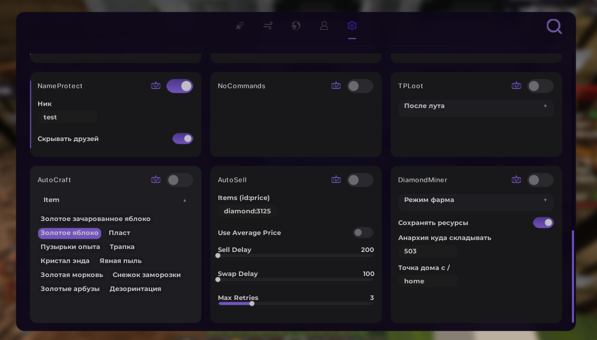

# AutoCraft для FT

**Полноценный автокрафт** под базу **exosware** .

### Возможности
- Автоматически ищет верстак рядом (радиус 4.5)
- Умная раскладка (кладёт по 1 или по 4 предмета)
- Автоматически убирает неправильные предметы из крафта
- Проверяет ресурсы и пишет, чего не хватает
- Сообщения в чат о крафте
- Автозабор готового предмета

### Рецепты
- Золотое зачарованное яблоко
- Золотое яблоко
- Пласт
- Трапка
- Кристалл Энда
- Пузырьки опыта
- Явная пыль
- Золотая морковь
- Золотые арбузы
- Дезориентация
- Снежок заморозки

### Установка
1. Создай класс `AutoCraft.java` в пакете `ru.levin.modules.misc`
2. Вставь туда код
3. Зарегистрируй функцию в `FunctionRegistry`

### Версия
**Fabric 1.21.4 | exosware**

---

**Скриншоты:**

